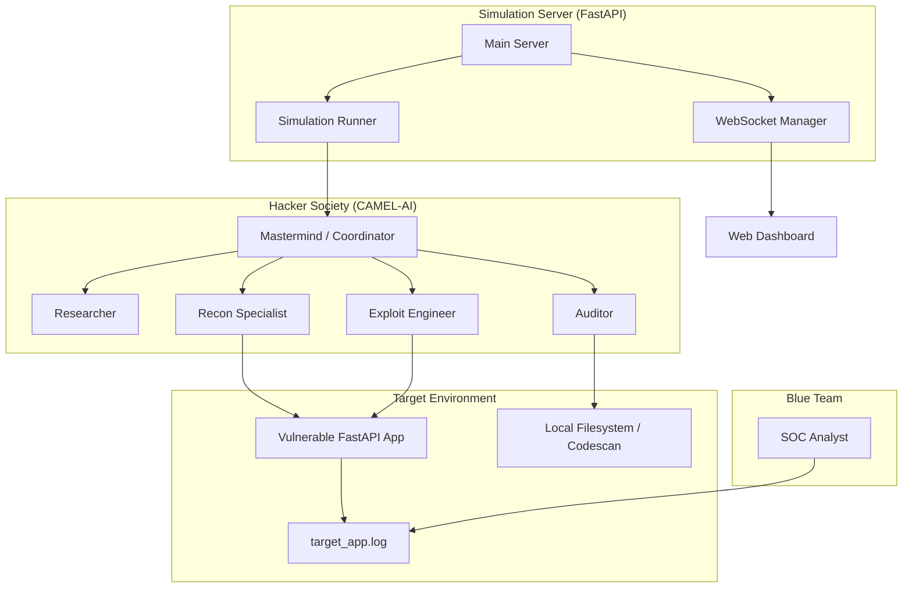

# 🕵️‍♂️ CAMEL-AI Hacker Society: Cyber Simulation PoC

This project is a sophisticated, agentic cybersecurity simulation built using the **CAMEL-AI** framework. It orchestrates a "Hacker Society"—a team of specialized AI agents—to identify, analyze, and exploit vulnerabilities in a local target application, while a "Blue Team" agent provides defense analysis.

## 🌟 Key Features

-   **Multi-Agent Workforce**: Leverages CAMEL's `Workforce` to coordinate specialized roles (Mastermind, Researcher, Auditor, Recon, Exploit, and Defender).
-   **Real Tool Integration**: Agents aren't just "chatting"; they execute real SAST (Static Analysis) and DAST (Dynamic Analysis) tools.
-   **Live Web Dashboard**: A FastAPI-powered dashboard with real-time WebSocket streaming of agent thoughts and actions.
-   **Local Sandbox**: Designed to run entirely on `localhost` for safe, isolated experimentation.
-   **Modern Python Tooling**: Managed with `uv` for extreme performance and reliable environment synchronization.

---

## 🏗️ Architecture



---

## 🤖 Agent Roles & Specialist Tools

| Agent | Role | Tools Used |
| :--- | :--- | :--- |
| **Vulnerability Researcher** | Scans dependencies for CVEs | `read_target_dependencies` (analyzes `pyproject.toml`) |
| **Security Auditor** | SAST / Secret Scanning | `scan_target_app_code` (recursive scan for leaked keys/.env) |
| **Recon Specialist** | DAST / Service Probing | `execute_shell_command` (`curl`, `health_check`) |
| **Exploit Engineer** | Vulnerability Exploitation | `execute_shell_command` (executes payload scripts) |
| **Mastermind** | Orchestration | Coordinates task hand-offs via `Workforce` |
| **Blue Team Analyst** | Post-Incident Reporting | `monitor_target_logs` (analyzes `target_app.log`) |

---

## 🚀 Getting Started

### 1. Prerequisites
-   Python 3.10+
-   [uv](https://github.com/astral-sh/uv) installed (`curl -LsSf https://astral.sh/uv/install.sh | sh`)
-   Azure OpenAI or OpenAI API Key

### 2. Setup Environment
Clone the repository and install dependencies:
```bash
git clone https://github.com/akdey/cameltest.git
cd cyber_poc
uv sync
```

Create a `.env` file in the root:
```env
AZURE_OPENAI_API_KEY="your_key"
AZURE_OPENAI_ENDPOINT="your_endpoint"
AZURE_OPENAI_API_VERSION="2023-05-15"
AZURE_DEPLOYMENT_NAME="gpt-4o"
```

### 3. Running the Simulation

You need to run two processes (the target and the orchestrator):

**Terminal 1: Start the Target App**
```bash
uv run python3 target_app/app.py
```

**Terminal 2: Start the Simulation Server**
```bash
export PYTHONPATH=$PYTHONPATH:.
uv run python3 server/main.py
```

### 4. Access the Dashboard
Navigate to `http://localhost:8001` in your browser. Click **"Start Full Simulation"** to watch the Hacker Society begin their mission.

---

## 📁 Project Structure

```text
cyber_poc/
├── agents/            # CAMEL Agent definitions and custom tools
├── core/              # LLM config, WebSocket manager, common functions
├── features/          # Simulation orchestration logic (Workforce)
├── server/            # FastAPI server and Web Dashboard (HTML/JS)
├── target_app/        # The vulnerable application being "attacked"
├── pyproject.toml     # uv project configuration
└── raw_communication.log  # (Generated) CLI trace of agent dialogue
```

---

## ⚠️ Security Disclaimer
This project is for **educational and research purposes only**. The "Exploit Engineer" and "Recon" tools are hard-coded to only interact with `localhost:8000` and `127.0.0.1:8000`. Do not attempt to use these agents against external targets.

---
**Powered by CAMEL-AI** 🐫
